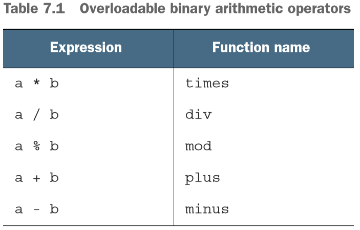
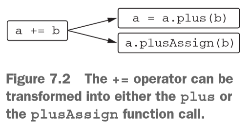
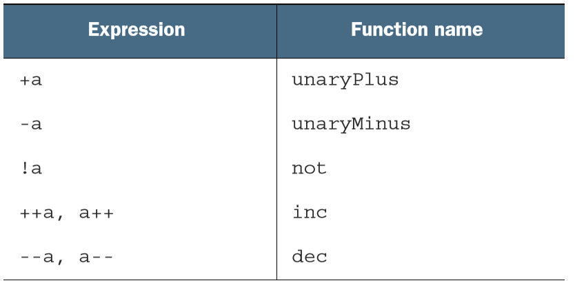
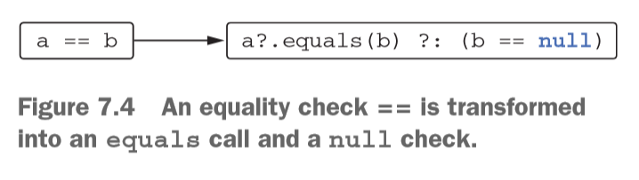
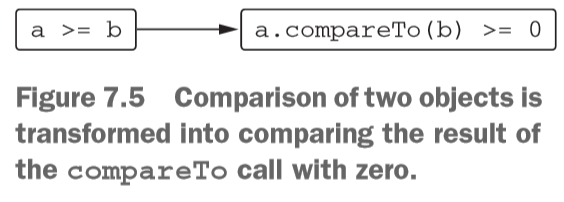
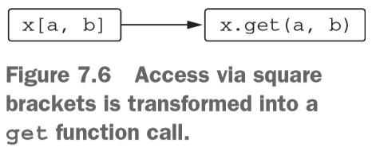
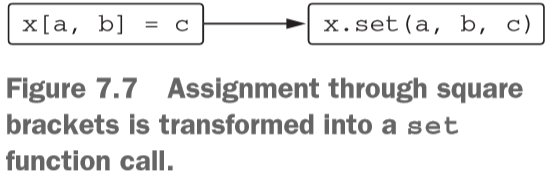
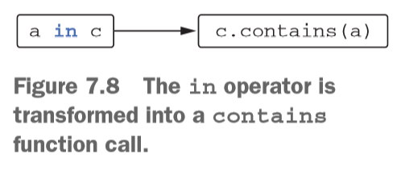

# 7_연산자 오버로딩과 기타 관례
## 다루는 내용
    - 연산자 오버로딩
    - 관례: 여러 연산을 지원하기 위해 특별히 이름이 붙은 메소드
    - 위임 프로퍼티

* 관례(convention)
    - 연산자를 비롯한 특정 기능과 미리 정해진 이름의 함수를 연결해 주는 기법
        - ex> plus 메소드 <==> + 연산자
    - ```함수 이름```에 의존하는 것은 타입에 의존하는 자바와 차이를 보임
        - 가정) 코틀린 관례를 인터페이스로 구현했다면
            - 기존 자바 클래스에 기능 추가 불가
        - 자바로 구현된 클래스에도 ```관례에 따라``` 확장함수를 통해 구현하면 기능을 추가 가능

## 7.1 산술 연산자 오버로딩
### 7.1.1 이항 산술 연산 오버로딩
* plus 연산자 구현
    ```        
    operator fun plus(other: Point): Point {
        data class Point(val x: Int, val y: Int) {
            return Point(x + other.x, y + other.y)
        }
    }

    >>> val p1 = Point(10, 20)
    >>> val p2 = Point(30, 40)
    >>> p1 + p2  // Point(x=40, y=60)
    ```    
* operator 키워드
    - 관례를 따르는 함수임을 나타내는 키워드
    - operator 키워드 없이 정해진 메소드 이름 사용시 에러 발생
* 확장 함수를 이용한 정의
    ``` 
    operator fun Point.plus(other: Point): Point {
        return Point(x + other.x, y + other.y)
    } 
    ```
* 오버로딩 가능한 이항 산술 연산자
    - 
* 두 피연산자의 타입이 다른 연산자 정의
    ``` 
    operator fun Point.times(scale: Double): Point {
        return Point((x * scale).toInt(), (y * scale).toInt())
    }
    >>> val p = Point(10, 20)
    >>> p * 1.5 // Point(x=15, y=30)
    ```
### 7.1.2 복합 대입 연산자 오버로딩
* 복합 대입(compound assignment)
    - +=, -=등의 연산자
    ``` 
    >>> var point = Point(1, 2)
    >>> point += Point(3, 4)
    >>> print(point) // Point(x=4, y=6)
    ```
    - 위의 경우 변수가 변경 가능한 경우에만 복합 대입 연산자를 사용할 수 있음
    - 기존 객체의 상태를 변경하게 만들고 싶은 경우
        - ex> 리스트에 원소 추가
            ```` 
            >>> val numbers = ArrayList<Int>()
            >>> numbers += 42
            >>> print(numbers[0]) // 42
            ````
        - 반환 타입이 Unit인 plusAssign 함수를 정의
            ``` 
            operator fun <T> MutableCollection<T>.plusAssign(element:T) {
                this.add(element)
            }
            ```
* 코드에 있는 +=를 plus와 plusAssign 양쪽으로 컴파일 가능
    - 
    - plus와 plusAssign 연산을 동시 정의하는 것은 지양
    - Point 처럼 ```변경 불가능```하다면 plus와 같이 새로운 값을 반환하는 연산만을 추가
    - 빌더와 같이 ```변경 가능한 클래스```를 설계한다면 plusAssign과 비슷한 연산만을 추가
* 컬렉션에 대해 두 가지 접근 방법
    - +와 -는 항상 새로운 컬렉션을 반환
    - +=와 -= 연산자는 객체 상태를 변화
        ``` 
        >>> val list = arrayListOf(1,2)
        >>> list += 3
        >>> val newList = list + listOf(4,5)
        >>> print(list) // [1,2,3]
        >>> print(newList) // [1,2,3,4,5]
        ```
    - 읽기 전용 컬렉션(immutable)에서 +=와 -=는 변경을 적용한 복사본 변환
        ``` 
        val mutableList = arrayListOf(1,2)
        mutableList += 3
        var immutableList = listOf(1,2)
        immutableList += 3
        println(mutableList)
        println(immutableList)
        ```
### 7.1.3 단항 연산자 오버로딩
* 오버로딩할 수 있는 단항 산술 연산자
    - 
    - ex) 증가 연산자
        ```
        operator fun BigDecimal.inc() = this + BigDecimal.ONE
        >>> var bd = BigDecimal.ZERO
        >>> print(bd++) // 0
        >>> print(++bd) // 2
        ```
## 7.2 비교 연산자 오버로딩
### 7.2.1 동등성 연산자: equals
* 동등성 검사
    - 
    - 직접 구현
        ``` 
        class Point(val x: Int, val y: Int) {
            override fun equals(obj: Any?): Boolean {
                if(obj === this) return true
                if(obj !is Point) return false
                return obj.x == x && obj.y == y
            }
        }
        >>> print(Point(10,20) == Point(10,20)) // true
        >>> print(Point(10,20) != Point(5,5)) // true
        >>> print(null == Point(1,2)) // false
        ```
        - ===는 서로 같은 객체를 가리키는지 검사
            - 오버로딩 할 수 없음
        - operator 키워드는 상위 클래스에 선언되어 있음
        - != 연산 지원
### 7.2.2 순서 연산자: compareTo
* 순서 연산자
    - 
    ``` 
    class Person(val firstName: String, val lastName: String): Comparable<Person> {
        override fun compareTo(other: Person): Int {
            return compareValues(this, other, Persion::lastName, Person::firstName)
        }
    }
    >>> val p1 = Person("Alice", "Smith")
    >>> val p2 = Person("Bob", "Johnson")
    >>> print(p1 < p2) // false
    ```
        - Comparable의 compareTo에도 operator 변경자가 붙어 있으므로 붙일 필요 없음

## 7.3 컬렉션과 범위에 대해 쓸 수 있는 관례
* in 연산자
    - 원소의 컬렉션이나 범위에 속하는지 검사
    - 컬렉션에 있는 원소를 이터레이션
### 7.3.1 인덱스로 원소에 접근: get과 set
* get 관례 구현하기
    ``` 
    operator fun Point.get(index: Int): Int {
        return when(index) {
            0->x
            1->y
            else -> throw 예외
        } 
    }
    >>> val p = Point(10,20)
    >>> print(p[1])
    ```
    - 
* set 관례 구현하기
    ``` 
    data class MutablePoint(var x: Int, var y: Int)
    operator fun MutablePoint.set(index: Int, value: Int) {
        when(index) {
            0->x=value
            1->y=vale
            else -> throw 예외
        }
    }
    >>> val p = MutablePoint(10,20)
    >>> p[1] = 42
    >>> print(p) // MutablePoint(x=10,y=42)
    ```
    - 
### 7.3.2 in 관례
* in 관례 구현하기
    ``` 
    data class Rectangle(val upperLeft: Point, val lowerRight: Point)
    operator fun Rectangle.contains(p: Point): Boolean {
        return p.x in upperLeft.x until lowerRight.x &&
            p.y in upperLeft.y until lowerRight.y 
    }
    >>> val rect = Rectangle(Point(10,20), Point(50,50))
    >>> print(Point(20,30) in rect) // true
    >>> print(Point(5,5) in rect) // false
    ```
    - 
### 7.3.3 rangeTo 관례
* ```..연산자```는 rangeTo 함수를 간략하게 표현하는 방법
    - 
* Comparable 인터페이스를 구현하면 rangeTo를 정의할 필요가 없음
    - 코틀린 표준 라이브러리에는 모든 Comparable 객체에 대해 적용 가능한 rangeTo 함수가 있음
        ``` 
        operator fun <T: Comparable<T>> T.rangeTo(that: T): ClosedRange<T>
        ```
    ``` 
    val now = LocalDate.now()
    val vacation = now..now.plusDays(10)
    >>> println(now.plusWeeks(1) in vacation)
    ```
### 7.3.4 for 루프를 위한 iterator 관례
* for 루프 안의 in은 iterator()를 호출하며 동작
    ``` 
    operator fun CharSequence.iterator(): CharIterator
    >>> for(c in "abc") { pirnt(c) }
    ```
    - iterator 메소드 구현
        - [날짜 범위에 대한 이터레이터 구현](IteratorImpl.kt)
## 7.4 구조 분해 선언과 루프
### 7.4.1 구조 분해 선언과 루프

## 7.5 프로퍼티 접근자 로직 재활용: 위임 프로퍼티
### 7.5.1 위임 프로퍼티 소개
### 7.5.2 위임 프로퍼티 사용: by lazy()를 사용한 프로퍼티 초기화 지연
### 7.5.3 위임 프로퍼티 구현
### 7.5.4 위임 프로퍼티 컴파일 규칙
### 7.5.5 프로퍼티 값을 맵에 저장
### 7.5.6 프레임워크에서 위임 프로퍼티 활용

## 7.6 요약