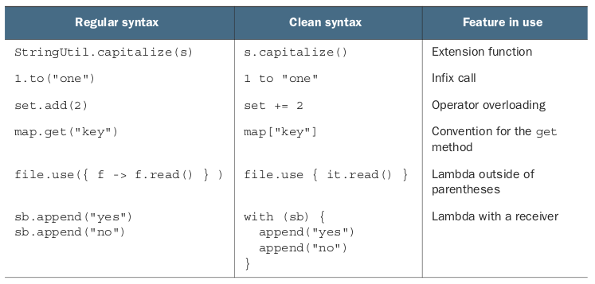
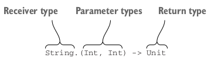

# 11_DSL 만들기
## 다루는 내용
    - 영역 특화 언어 만들기
    - 수신 객체 지정 람다 사용
    - invoke 관례 사용
    - 기존 코틀린 DSL 예제

## 11.1 API에서 DSL로
* 코틀린이 지원하는 간결한 구문
    - 
    - infix call
        - 127p
        - 인자가 하나뿐인 일반 메소드나 확장 함수에 사용 가능
        - infix 변경자를 함수 선언 앞에 추가해야 함
        ``` 
        infix fun Any.to(other: Any) = Pair(this, other)
        ```
    - Lambda outside of parentheses
        - 203p 
        - 함수 호출시 맨뒤에 있는 인자가 람다 식이라면 람다를 괄호 밖으로 뺄 수 있음
    - Lambda with a receiver(수신 객체 지정 람다)
        - 236p
        - 수신 객체를 명시하지 않고 람다의 본문 안에서 다른 객체의 메소드 호출 가능
### 11.1.1 영역 특화 언어라는 개념
* Domain-specific language vs general-purpose programming language
    - 선언적(declarative) vs 명령적(imperative)
        - 원하는 결과를 위해 기술하고 세부 실행은 언어를 해석하는 엔진에 맡김 
### 11.1.2 내부 DSL
* 범용 언어로 작성된 DSL
    - 외부 DSL의 예
        ``` 
        SELECT Country.name, COUNT(Customer.id)
        FROM Country
          JOIN Customer
            ON Country.id = Customer.country_id
        GROUP BY Country.name
        ORDER BY COUNT(Customer.id) DESC
          LIMIT 1
        ```
    - 내부 DSL의 예
        ``` 
        (Country join Customer)
          .slice(Country.name, Count(Customer.id))
          .selectAll()
          .groupBy(Country.name)
          .orderBy(Count(Customer.id), isAsc = false)
          .limit(1)
        ```
### 11.1.3 DSL의 구조
* DSL과 일반 API의 차이점 
    - 문법
        - 여러 함수 호출을 조합하여 연산을 만듬
        - 타입 검사기는 여러 함수 호출이 바르게 조합됐는지 검사
        ``` 
        fun createSimpleTable() = createHTML().
        table {
            tr {
                td { +"cell" }
            }
        }
        ```
        - td는 상위에 tr이 정의되어야만 사용 가능
    - 구조
        - 람다 중첩
            ```
            dependencies {
                compile("junit:junit:4.11")
                compile("com.google.inject:guice:4.1.0")
            }
            ```
            - 일반 api
            ```
            project.dependencies.add("compile", "junit:junit:4.11")
            project.dependencies.add("compile", "com.google.inject:guice:4.1.0")
            ```
        - 메스드 호출 연쇄
            ``` 
            str should startWith("kot")
            ```
            - 일반 API 
            ```
            assertTrue(str.startsWith("kot"))
            ```
### 11.1.4 내부 DSL로 HTML 만들기
``` 
fun createSimpleTable() = createHTML().
    table {
        tr {
            td { +"cell" }
        }
    }
```
``` 
fun createAnotherTable() = createHTML().
    table {
        val numbers = mapOf(1 to "one", 2 to "two")
        for ((num, string) in numbers) {
            tr {
                td { +"$num" }
                td { +string }
            }
        }
    }
```

## 11.2 구조화된 API 구축: DSL에서 수신객체 지정 DSL 사용
### 11.2.1 수신 객체 지정 람다와 확장 함수 타입
* [기존 buildString](buildstring/BuildStringDemo1.kt)
    ```
    val s = buildString {
            it.append("Hello, ")
            it.append("World!")
        }
    ```
    - it를 없앨수는 없을까?
* [수신 객체 지정 람다(lambda with a receiver) 적용](buildstring/BuildStringDemo2.kt)
    ``` 
    val s = buildString2 {
            this.append("Hello, ")
            append("World!")
        }
    ```
    * 확장 함수 타입을 사용
        - 
* 확장 함수의 변수 정의
    - [확장 함수 사용 예](ExtensionFunction.kt)
* [apply 적용](buildstring/BuildStringDemo3.kt)
    ``` 
    inline fun <T> T.apply(block: T.() -> Unit): T }
        block()
        return this
    }
    inline fun <T, R> T.with(receiver: T, block: T.()->R): R =
        receiver.blcok()
    ```
### 11.2.2 수신 객체 지정 람다를 HTML 빌더 안에서 사용
* [html 빌더 만들기](html/HtmlBuild.kt)
### 11.2.3 코틀린 빌더: 추상화와 재사용을 가능하게 하는 도구

## 11.3 invoke 관례를 사용한 더 유연한 블록 중첩
### 11.3.1 invoke 관례: 함수처럼 호출할 수 있는 객체
* operator 변경자가 붙은 invoke 메소드가 있을 시 객체를 함수처럼 호출 가능
    ``` 
    class Greeter(val greeting: String) {
        operator fun invoke(name: String) {
            println("$greeting, $name")
        }
    }
    val bavarianGreeter = Greeter("servus")
    bavarianGreeter("Dmitry")
    ```
### 11.3.2 invoke 관례와 함수형 타입
* 함수형 인터페이스 안에는 invoke 메소드가 있음
    ``` 
    interface Function2<in P1, in P2, out R>{
     operator fun invoke(p1: P1, p2: P2) : R
    }
    ```
    - [Issue 예제](IssueFunction.kt)
### 11.3.3 DSL의 invoke 관례: 그레이드에서 의존과계 정의
* 그레이들 DSL
    ``` 
    dependencies.compile("junit:junit:4.11")
    dependencies {
        compile("junit:junit:4.11")
    }
    ```
    - [어떻게 2가지 모두 지원가능할까?](dependency.kt)
    
## 11.4 실전 코틀린 DSL
### 11.4.1 중위 호출 연쇄: 테스트 프레임워크의 should
* DSL 단언문 표현
    ``` 
    s should startWith("kot")
    ```
    - should 함수
    ```
    infix fun <T> T.should(matcher: Matcher<T>) = matcher.test(this)
    ```
* 메소드 호출 연쇄
    ``` 
    "kotlin" should start with "kot"
    ```
    - 일반 함수
    ```
    "kotlin".should(start).with("kot") 
    ```
    - should와 with 구현
    ``` 
    object start
    infix fun String.should(x: start): StartWrapper = StartWrapper(this)
    
    class StartWrapper(val value: String) {
        infix fun with(prefix: String) =
            if (!value.startsWith(prefix))
                throw AssertionError("String does not start with $prefix: $value")
            else Unit
    }
    ```
### 11.4.2 원시 타입에 대한 확장 함수 정의: 날짜 처리
### 11.4.4 안코: 안드로이드 UI를 동적으로 생성하기

## 11.5 요약